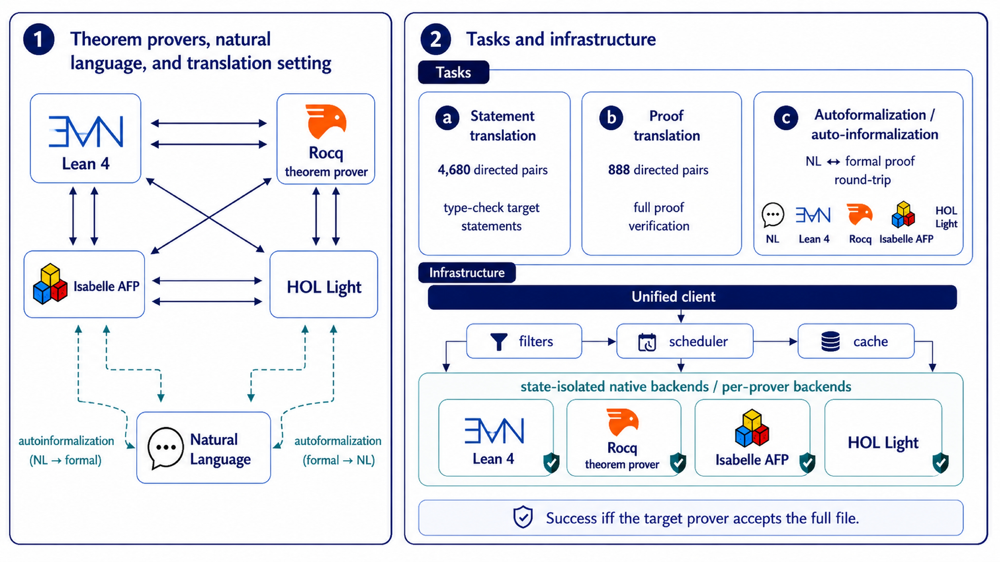

# ITPEval: Benchmarking Formal Translation Across Interactive Theorem Provers



**ITPEval** is the first benchmark for evaluating automated formal proof translation across four major interactive theorem provers (ITPs): Lean 4, Rocq (Coq), Isabelle/HOL, and HOL Light.

## Benchmark

ITPEval comprises **390 aligned files** spanning 1,712 theorems and lemmas, each formalized in all four ITPs:

- Lean 4: Calculus of Inductive Constructions (`.lean`)
- Rocq (Coq): Calculus of Inductive Constructions (`.v`)
- Isabelle/HOL: higher-order logic (`.thy`)
- HOL Light: higher-order logic (`.ml`)

The benchmark is organized into two tiers that isolate distinct aspects of translation difficulty:

| Tier | Source | Files | Description |
|---|---|---|---|
| A (Controlled) | Babel-formal | 16 | Self-contained, axiomatized theorems (165 lemmas). Isolates foundational translation difficulty. |
| B (Ecosystem) | Hundred Theorems | 58 | Classical theorems from real ITP libraries (1,231 lemmas). Tests library API and tactic translation. |
| B (Ecosystem) | miniF2F | 316 | Competition math statements. Tests pure statement translation without multi-lemma structure. |

Every file is formalized in all four ITPs (4-way intersection), yielding **12 balanced directed translation pairs** per file. Two translation modes are evaluated:

- **Statement translation** (`stmts`): all 390 files, 4,680 directed pairs per model
- **Proof translation** (`proofs`): Babel-formal + Hundred Theorems (74 files), 888 directed pairs per model

## Repository Structure

```
itp-interop/
├── eval/                # LLM translation, verification & BEq pipeline
│   ├── data/            # Benchmark JSON files (stmts.json, proofs.json)
│   ├── pipeline/        # Pipeline implementation (translation/ + cycle/ + beq/ subpackages)
│   └── results/         # Local generated outputs
├── itpeval/             # ITP toolchain installer and verification harness
├── data/                # Raw benchmark data and preprocessing scripts
    ├── babel-formal/
    ├── hundred-theorems/
    └── minif2f/
```

## Quick Start

### 1. Install ITP toolchains

```bash
cd itpeval
./bin/bootstrap-macos.sh          # or bootstrap-system.sh on Linux
./bin/itpeval install lean4 rocq isabelle hol-light
./bin/itpeval check  lean4 rocq isabelle hol-light
```

See [`itpeval/README.md`](itpeval/README.md) for per-prover details.

### 2. Install Python dependencies

```bash
pip install anthropic openai google-genai python-dotenv
```

### 3. Set API keys

```bash
cp eval/.env.example eval/.env
# fill in ANTHROPIC_API_KEY, OPENAI_API_KEY, GEMINI_API_KEY, OPENROUTER_API_KEY
```

### 4. Run an eval

```bash
# Submit batch translation jobs
python3 -m eval.pipeline.translation.batch_run submit \
    --mode stmts --sources babel-formal,hundred-theorems,minif2f

# Collect results and verify (requires ITP toolchains)
python3 -m eval.pipeline.translation.batch_run collect eval/results/batch_jobs/<timestamp>.json
```

See [`eval/README.md`](eval/README.md) for full pipeline documentation.

### 5. BEq equivalence checking

After verification, check whether verified translations are semantically equivalent to reference statements:

```bash
python3 -m eval.pipeline.beq.beq_check \
    eval/results/verified/stmts_claude-sonnet-4-6_20260426.jsonl \
    --source minif2f
```

### 6. Using the benchmark data directly

```python
import json

stmts  = json.load(open("eval/data/stmts.json"))   # 1,560 records
proofs = json.load(open("eval/data/proofs.json"))   # 296 records

# All Lean 4 statements
lean4_stmts = [r for r in stmts if r["prover"] == "lean4"]

# All 4 ITP variants of one theorem
theorem_1 = [r for r in stmts if r["theorem_id"] == 1]
```

See [`eval/data/README.md`](eval/data/README.md) for the full record schema.
